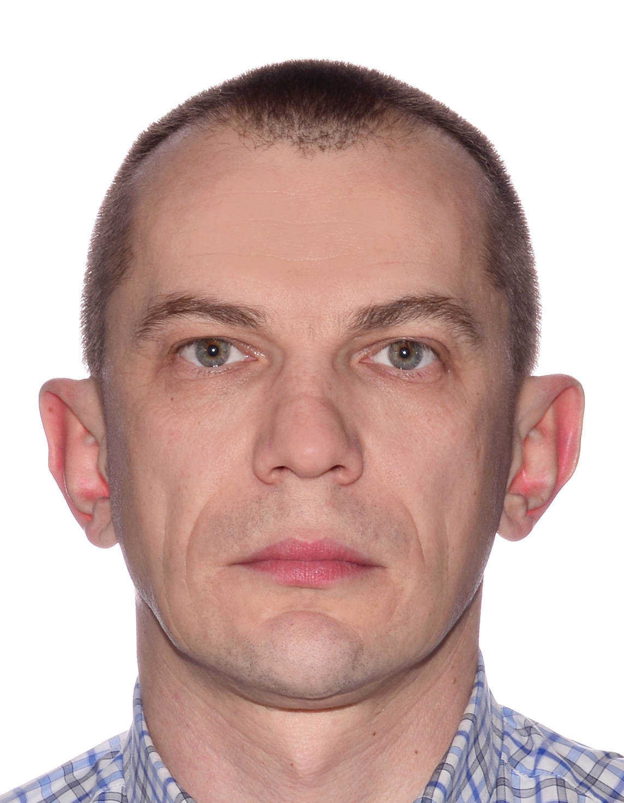

# Roman Shatrov

**Junior Frontend developer**

**My professional goal is to work as a Front-end Developer. My aim to work in the IT sector because I need constant development and receiving an experience, that will stay with me for life. Every day I work with HTML, CSS, Java Script. And want to evolve constantly in JavaScript, new frameworks and other IT technologies.**

## Projects

1. Piggie_Game
2. Web_Bankist
3. Bankist_App_Starter
4. Map_ty

## Employment history

### Beginner - Magnetic Point

January 2021 - April 2021

- Cutting graphic templates from PSD to HTML

### Project Manager - REMONTOWA Electrical Solutions, Gdansk

2018 - 2021

- Manage clients projects. Production, delivery, installation of electrical solutions in onshore/offshore segment.
- For the comprehensive implementation of projects, organized cooperation between partners.
- For the non-standard solution on projects, found and joined new producers and suppliers.

### Export Sales Manager, Sales Manager, Business Development Manager Ukraine, Support Engineer technical, Quality Specialist - ABB, GE, Schneider Electric, ets...

2000 - 2018

- I was responsible for business development and sales.
- Have carried out the development of new products for new segments.
- Systematically organized presentations, trainings and seminars.

## Education

### Mgr. Electric, Kiev Politechnical Institute

1993 - 1999

### Full Stack Developer, Udemy: The Web Developer Bootcamp

2020 - 2021

### Developer JS, Udemy: The Complete JavaScript Course

2021

### CSS - The Complete Guide, Udemy: CSS, SASS

2021

Format: 

Format: 

Designed 2021

Format: 
